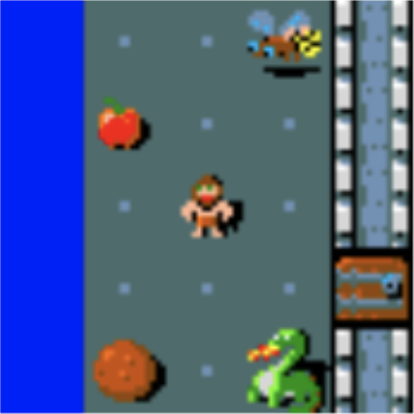
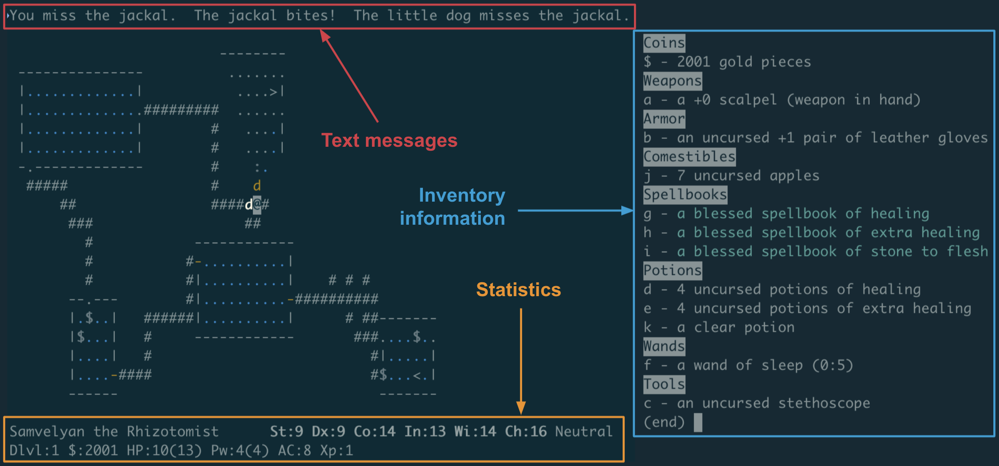

# Observation Spaces

## Overview

MiniHack supports several forms of observations, including global or agent-centred viewpoints (or both) of the grid. The table bellow illustrateds three forms of agent-centred observations of the grid of the map in MiniHack.

Pixel Observations         |  Symbolic Observations       |  Textual Observations
:-------------------------:|:----------------------------:|:--:
 |   |


In addition, observations can include player statistics, in-game text messages, and inventory information.




## Specifying options

MiniHack has a dictionary-structured observation space. Most keys are inherited from NLE, while some are added in MiniHack. To make sure that the desired observations are returned by the environment, the corresponding options should be passed during the initialisation. The `observation_keys` parameter can be used to specify the observation space in any MiniHack environment:

```python
env = gym.make(
   "MiniHack-River-v0",
   observation_keys=("glyphs", "chars", "colors", "pixel"),
)
```

Note that using different observation keys can make environments significantly easier or harder.

## Options

Name        |  Description
:----------:|:------------------:
`glyphs` | a $21\times79$ matrix of glyphs (ids of entities) on the map. Each glyph represents an entirely unique entity, so these are integers between 0 and 5991. In the standard terminal-based view of NetHack, these glyphs are represented by characters, with colours and other possible visual features.
`chars` | a $21\times79$ matrix of the characters representing the map.
`colors` | a $21\times79$ matrix of the colours of each of the characters on the map (some characters represent different objects or monsters depending on their colour).
`specials` | a $21\times79$ matrix of special extra information about the view of that cell on the map, for example, if the foreground and background colour should be reversed.
`screen_descriptions` | a $21\times79\times80$ tensor of utf-8 encodings of textual descriptions of each cell present in the map. NetHack provides these textual descriptions (which can be accessed by the user by using the describe action on a specific tile).
`pixel` | a representation of the current screen in image form, where each cell is represented by a $16\times16\times3$ image, meaning the entire observation is so $336\times1264\times3$ (with 3 channels for RGB).
`blstats` | a representation of the status line at the bottom of the screen, containing information about the player character's position, health, attributes and other statuses. It comes in the form of a dimension $25$ vector.
`message` | the utf-8 encoding of the on-screen message displayed at the top of the screen. It's a $256$-dimensional vector.
`inv_glyphs` | a $55$-dimensional vector representing the glyphs present in the current inventory view.
`inv_letters` | a $55$-dimensional vector representing the letters present in the current inventory view.
`inv_oclasses` | a $55$-dimensional vector representing the class of objects present in the current inventory view.
`inv_strs` | a $55\times80$ matrix containing utf-8 encodings of textual descriptions of objects present in the current inventory view.
`tty_chars` | the character representation of the entire screen, including the message and map, of size $24\times80$.
`tty_colors` | the color representation of the entire screen, including the message and map, of size $24\times80$.
`tty_cursor` | the location of the cursor on the screen, a 2-dimensional vector of (x,y) coordinates.

````{note}
For `glyphs`, `chars`, `colors`, `specials`, `pixel`, `screen_descriptions`, `tty_chars`, and `tty_colors` a cropped observation centered the agent can be used by passing the observation name suffixed with `_crop` (e.g. `chars_crop`). This is a NxN matrix centered on the agent's current location containing the information normally present in the full view. The size of the crop can easily be configured using the `obs_crop_h` and `obs_crop_w` parameters of the environment (9 by default). Cropped observations can facilitate the learning, as the egocentric input makes representation learning easier.
````